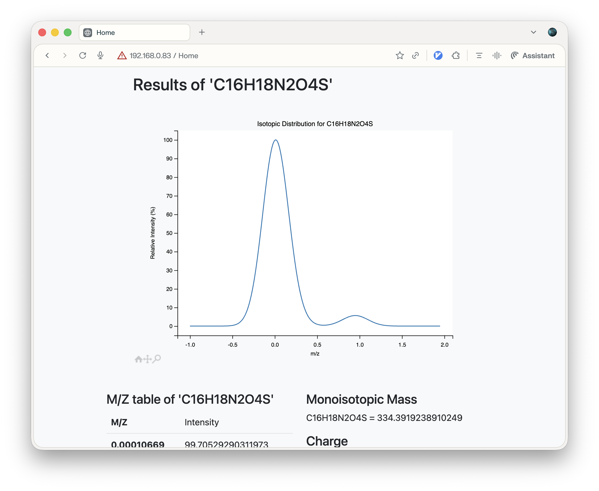

# Web app for Mass spectrometry



Flask webapp for Mass spectrometry data analysis, optimized for KBSI workflows.

## Features
- **Isotope Pattern Calculator**: Accurate isotopic distribution calculations.
- **Mass Calculator**: Molecular mass calculation from formulas.
- **Exact Mass Calculator**: Single isotope precision version.
- **Mass-to-Formula Converter**: Convert m/z values back to chemical formulas.
- **Online GC and GC/MS Viewer**: Data file visualization.

## Modern Environment (uv)
This project uses [uv](https://github.com/astral-sh/uv) for fast and reliable dependency management.

### Prerequisites
- Python >= 3.11
- uv installed (`curl -LsSf https://astral-sh.uv/install.sh | sh`)

### Installation
Clone the repository and sync the environment:
```bash
uv sync
```

### Running the Application
To start the Flask development server (Default port: 8080):
```bash
# Set custom port (optional)
export PORT=8080
# Set debug mode (optional)
export FLASK_DEBUG=true
# Run the application
uv run python main.py
```
Or using Flask command:
```bash
uv run flask --app main run --host 0.0.0.0 --port 8080
```

### Development & Testing
Run linter and tests:
```bash
# Run Ruff linter
uv run ruff check .

# Run tests
uv run pytest tests/
```

## Project Structure
- `main.py`: Flask application entry point.
- `isocalc.py`: Isotopic calculation engine.
- `mspy/`: Core mass spectrometry package.
- `templates/` & `static/`: Frontend assets.
- `tests/`: Automated test suite.

## License
All rights reserved by KBSI.
